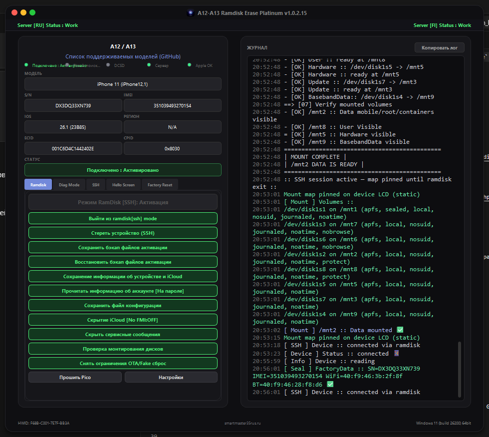
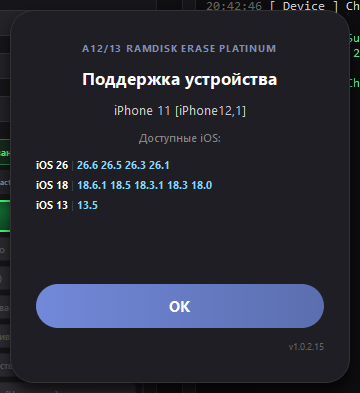

# A12 / A13 Ramdisk Erase Platinum

**Professional ramdisk toolkit for Apple A12–A13 devices on Windows**

[⬇️ Download latest release](https://github.com/smartmaster35rus-dev/A12-13-Ramdisk-Erase-tool-Platinum-win/releases/latest) · [📋 Supported models](https://github.com/smartmaster35rus-dev/ramdisk-A12-13) · [🌐 Activator site](https://smartmaster35rus-activator.ru/compatible.php)

---

## 🇷🇺 О программе

**A12/13 Ramdisk Erase Platinum** — десктопный инструмент для работы с iPhone/iPad на чипах **Apple A12 и A13** через SSH ramdisk: загрузка, монтирование разделов, чтение конфигурации, бэкап/восстановление activation, erase, Hello Screen, Diag Mode и многое другое.

Интерфейс в стиле Platinum: тёмная тема, live-журнал, статусы сервера RU/FI и Apple Seed, ECID-регистрация.

## 🇬🇧 About

**A12/13 Ramdisk Erase Platinum** is a Windows desktop toolkit for **Apple A12 & A13** devices over SSH ramdisk: boot, partition mount, device info, activation backup/restore, erase, Hello Screen bypass, Diag Mode, and more.

Platinum UI: dark theme, live log, RU/FI server + Apple Seed health, ECID registration.

---

## 📸 Screenshots

| Device connected | SSH ramdisk session |
|:---:|:---:|
|  |  |

| iOS support list | Mount partition check |
|:---:|:---:|
|  |  |

| Activation backup | Restore snapshot |
|:---:|:---:|
|  |  |

---

## ✨ Key features

| Feature | Description |
|---------|-------------|
| 🚀 **Ramdisk boot** | Auto chain: PwnedDFU → iBSS/iBEC → kernel → SSH ramdisk |
| 📦 **Auto mount** | Full APFS mount (`/mnt1`–`/mnt9`) + mount checker UI |
| 📱 **Device info** | Model, SN, IMEI, iOS, ECID, CPID — auto-read after mount |
| 💾 **SM35 backup** | Activation snapshot: `sisv`, `record`, `data_ark`, gestalt, FairPlay |
| 🔄 **Restore** | One-click restore original / pick another backup |
| 🗑️ **Factory erase** | SSH nvram oblit + auto reboot |
| 👋 **Hello Screen** | Bypass workflows, iCloud hide, service message hide |
| 🔧 **Diag Mode** | SysCFG read/write via DCSD serial |
| 🌐 **Online** | Ramdisk catalog from GitHub Releases, server health, model names from site API |
| 🌍 **i18n** | Russian · English · Spanish |

---

## ⬇️ Download

Go to **[Releases](https://github.com/smartmaster35rus-dev/A12-13-Ramdisk-Erase-tool-Platinum-win/releases/latest)** and download:

| File | Purpose |
|------|---------|
| `A12_13_Ramdisk_Tool_Platinum_X.X.X.X.exe` | Portable build (no install) |
| `A12_13_Ramdisk_Erase_Platinum_Setup.exe` | Inno Setup installer |

> ⚠️ Run **as Administrator**. Requires **Pico 2** with usbliter8 firmware for checkm8 exploit.

---

## 📋 Requirements

- **OS:** Windows 10 / 11 (64-bit)
- **USB:** quality cable, Apple USB driver (tool can auto-install DFU driver)
- **Hardware:** Raspberry Pi Pico 2 flashed with usbliter8 (or compatible checkm8 setup)
- **Devices:** iPhone XS / XR / 11 series, SE 2, iPad 8th/9th gen and other A12–A13 models with ramdisk in [catalog](https://github.com/smartmaster35rus-dev/ramdisk-A12-13/releases)
- **Network:** internet for ramdisk download, ECID check, server features (offline index bundled)

---

## 🔗 Related links

| Resource | URL |
|----------|-----|
| Ramdisk images | [smartmaster35rus-dev/ramdisk-A12-13](https://github.com/smartmaster35rus-dev/ramdisk-A12-13) |
| Activator / support | [smartmaster35rus-activator.ru](https://smartmaster35rus-activator.ru/compatible.php) |
| macOS build | [A12-13-Ramdisk-Erase-tool-Platinum-mac](https://github.com/smartmaster35rus-dev/A12-13-Ramdisk-Erase-tool-Platinum-mac/releases) |

---

## 📝 Changelog

See [Releases](https://github.com/smartmaster35rus-dev/A12-13-Ramdisk-Erase-tool-Platinum-win/releases) for full notes.

**v1.0.2.16** — auto device info after mount fix, startup crash fix, server boot logos  
**v1.0.2.15** — GitHub ramdisk migration, site model labels, server health fix  

---

## ⚖️ Disclaimer

This tool is intended for **authorized service and research** on devices you own or are permitted to work on. The author is not responsible for misuse.

---

**SmartMaster35Rus** · [smartmaster35rus.ru](https://smartmaster35rus-activator.ru/compatible.php)

